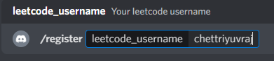
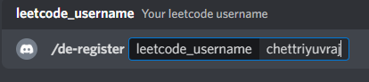
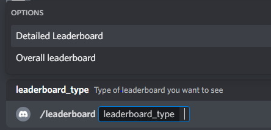
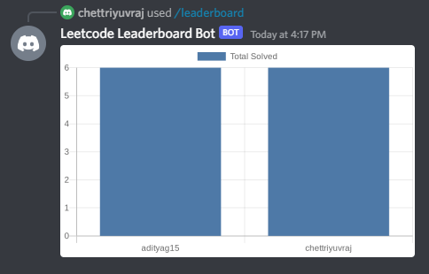
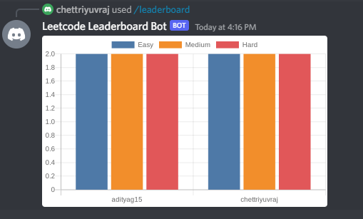
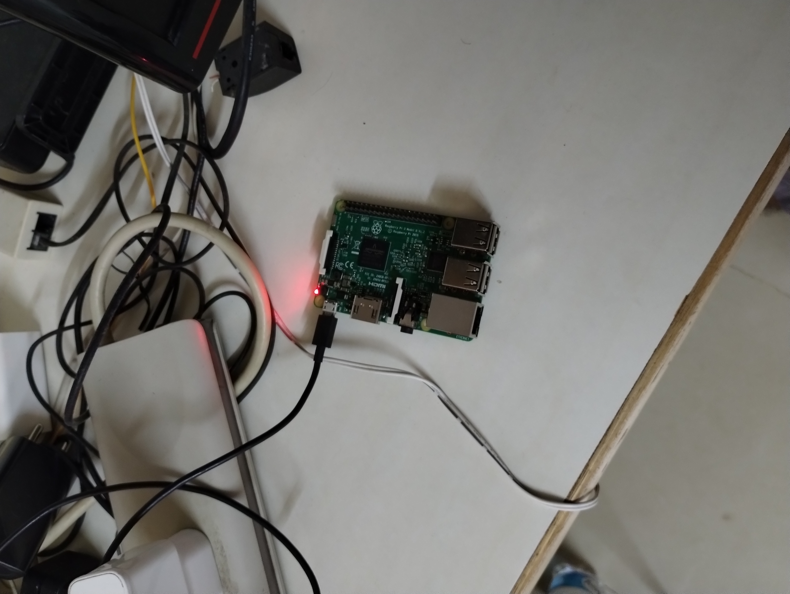
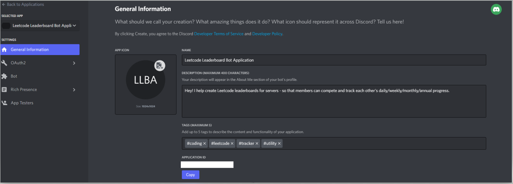
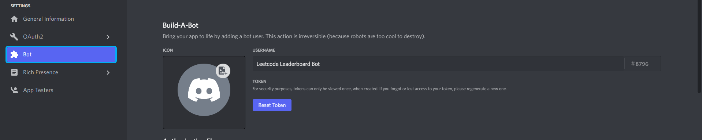
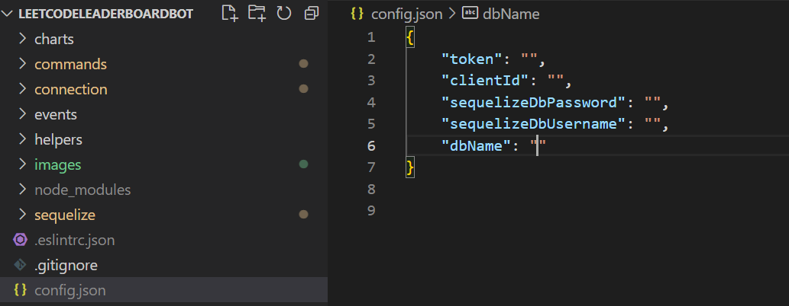

# Leetcode Leaderboard Discord Bot

## Bot in action

The bot works basis 3 simple slash commands:

* **/register <enter-leetcode-username>**

  To add your Leetcode username to the leaderboard.
   
  
  
   

* **/de-register**
 Remove your registered Leetcode username (if you don't want your username in the leaderboard anymore or want to register a different username).

   

  
   

* **/leaderboard**
  
   Generates a Chart.js bar chart showing the number of problems solved 
    

  
   

  
   

  

   

This bot is currently being hosted on my home server - an old Raspberry Pi 3.

## Background 
I always struggle with motivation to keep up with Leetcode, and I've found peer accountability groups super-helpful in this regard. 

I recently joined one such Discord server and figured creating a Discord bot to maintain a Leetcode leaderboard for the server would be fun.

## Basic workflow

* Leetcode has a public GraphQL API which returns Leetcode stats on providing Leetcode username.
 
* A cron-job (using node-cron) runs on the server every 45 minutes to fetch the Leetcode stats for all registered users.
 
* Charts generated using Charts.js.

## Setup

Here's how you can setup this bot for your own Discord Server:

* Fork this repository.
 

* Create your own Discord application (bots reside inside applications) [here](https://discord.com/developers/applications). **Grab the Application ID (it is your client ID)** from here. Do not share this with anyone.

  
   

* Create a bot from the Bot section in the sidebar and **click on 'Reset Token' to grab your bot token**. Again, this must be top secret!
  
   

* [Download PostgreSQL](https://www.postgresql.org/).

  

* Setup **username, password and a new database** using psql command line tool.
 

* Create a file named _config.json_ in your root directory and **add the keys you grabbed above**.

  
   

* [Download NodeJS](https://nodejs.org/en/download/current/) 

 

* Run '_npm i_' command in the terminal - inside your forked project directory.
 

* Run '_node index.js_' command. Your bot is now online!
 

* Invite the bot to your server using this link format: <add image> You can now use the bot :)

## Notes

* You will probably need to host your bot + database somewhere if you want it online all the time.
  Free hosters like Heroku have a mandatory downtime so I dug my old Raspberry Pi to host it. (setting up the Pi turned into a separate project by itself :P).
   

* No load testing/optimization has been done so you should probably expect this bot to crumble with large loads.
 

* Feel free to use this as a base for something better/point out issues.

## Tools and Technologies
![Node][node.js]

![PostgreSQL][postgresql]

![RaspberryPi][respberrypi]

[node.js]: https://img.shields.io/badge/NodeJS%20-yellow?style=for-the-badge&logo=nodedotjs
[postgresql]: https://img.shields.io/badge/PostgreSQL%20-lightgrey?style=for-the-badge&logo=postgresql
[respberrypi]: https://img.shields.io/badge/Raspberry%20Pi%20-red?style=for-the-badge&logo=raspberrypi

## References

* [Setting up a Discord bot with discord.js](https://discordjs.guide/)

* [Sequelize ORM documentation - for using PostgreSQL with node](https://sequelize.org/)

* [Setting up a Raspberry Pi](https://projects.raspberrypi.org/en/projects/raspberry-pi-setting-up/3)

* [Using an Android Device to write Raspberry Pi SD Cards](https://www.tomshardware.com/how-to/android-write-raspberry-pi-sd-cards)

* [Use Windows Laptop as a monitor for Raspberry Pi](https://beebom.com/how-use-windows-laptop-as-monitor-raspberry-pi/)
